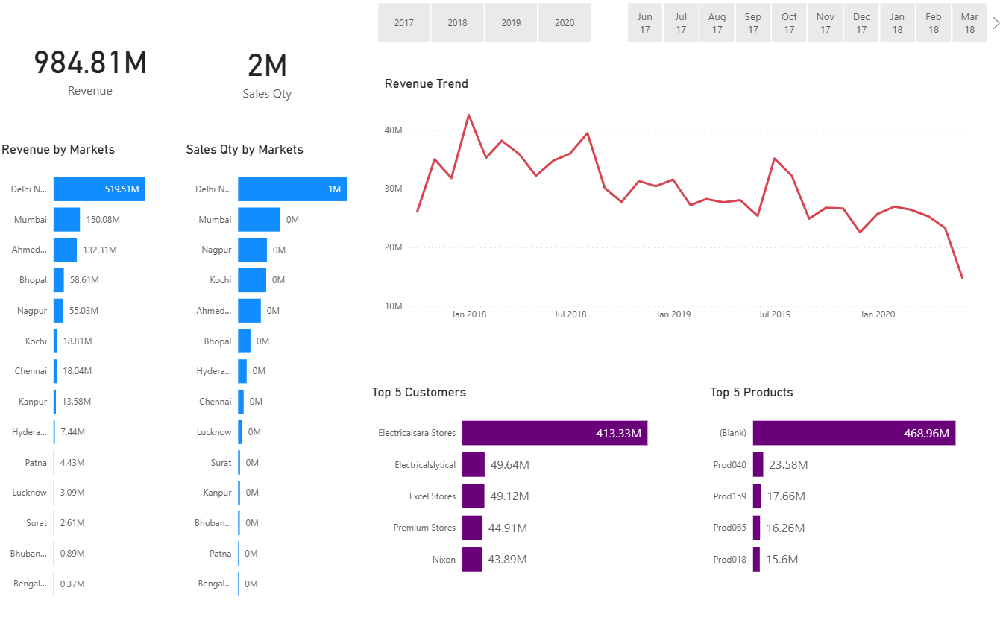

# Sales Insight

📌 Project Overview 

In today’s fast-changing market, businesses often struggle to scale due to a lack of actionable insights. This Power BI dashboard provides real-time sales insights, enabling organizations to:

- Monitor key sales KPIs
- Identify revenue growth opportunities
- Improve decision-making with data-driven strategies

🔹 Objectives

- Track overall sales performance
- Analyze revenue trends over time
- Identify top-performing products/customers/regions
- Keep track of Revenue and Sales Quantity

🛠 Tools & Technologies

Power BI – Dashboard & Visualization
SQL – Data cleaning/processing

📈 Dashboard Features

KPIs: Total Revenue, Sales Quantity

Visuals:
- Revenue trend over time
- Sales Qty and Revenue by Markets
- Top 5 products by revenue
- Top 5 Customers by revenue

📸 Dashboard

